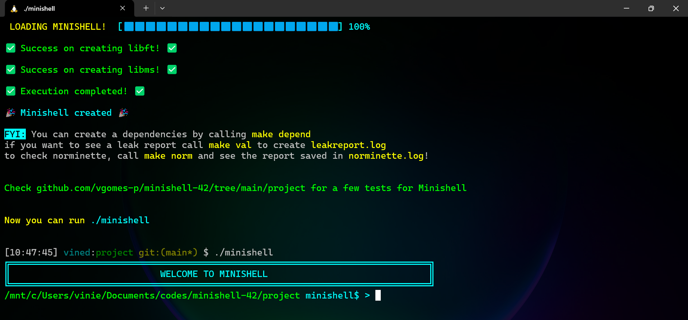

Minishell-42 is a minimalist Unix-style shell implemented in C, created to mimic basic behaviors of shells such as bash. It was developed as part of the 42 curriculum and focuses on understanding core system programming concepts like process control, file descriptors, built-ins, redirections, pipes, environment variables, and signal handling.


# 📥 Requirements
Before building and running the project:
- A Unix-like system (Linux, macOS, or Windows with WSL)
- A C compiler (`cc`, `gcc`, or similar)
- `make` installed
- GNU Readline library for command line input handling (see the end of readme)

### 1 - Cloning the Repository
```bash
git clone git@github.com:vgomes-p/minishell-42.git
```

### 2 - Navigate into the project directory
```bash
cd minishell-42/project
```

### 3 - Run the command make
```bash
make
```
This will generate the `minishell` executable.

### 4 - Running the Shell
```bash
./minishell
```

# Makefile Shortcuts
### Rebuild in debug mode
```bash
make debug
```
### Recreate the binary
```bash
make re
```
### Create dependencies read file
> To see the program dependencies, run:
```bash
make depend
```
> and then
```bash
cat dependencies.mk
```
> or open the <dependencies.mk> on your favorite file reader.
### Clean build artifacts
```bash
make clean
```
or
```bash
make fclean
```

# Installing Readline (If Needed)
### 1 - Run the following commands
### On Linux / WSL
```bash
sudo apt-get update
```
```bash
sudo apt install libreadline-dev
```
### On macOS
```bash
brew install readline
```
> Machine may require linking include and lib paths depending on your environment.